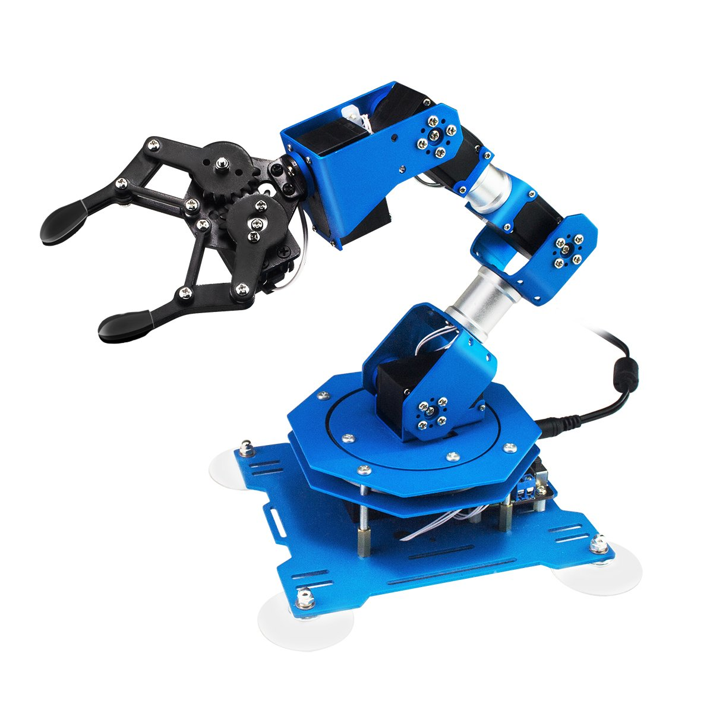

xArm Lewansoul ROS Documentation
================================

This is the documentation for ROS integration of the `Lewansoul-Hiwonder xArm <https://www.hiwonder.hk/collections/robotic-arm/products/xarm-hiwonder-6dof-bus-servo-robotic-arm-based-on-scratch-arduino-programmable-robotic-arm>`_.

    
Here you will find:

* Low level drivers to comunicate with the robot either in python or C++
* Hardware interface to control the robot with either position or trajectory control
* Integration with RVIZ and moveit including URDF and SRDF files which allow you to plan trajectories

.. note::
   At the moment the gripper has not been yet integrated.

.. toctree::
   :maxdepth: 2
   :caption: Get started
   
   user_guide/1_1_introduction
   
.. toctree::
   :maxdepth: 2
   :caption: Software description
   
   user_guide/1_2_software_description.rst
